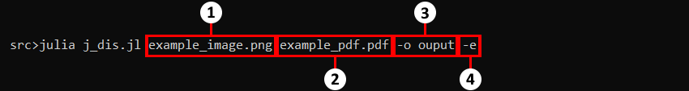
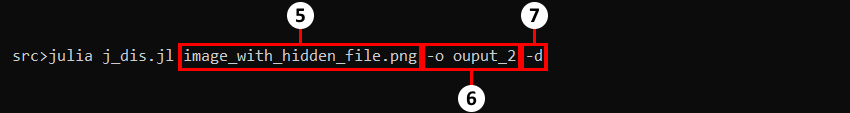
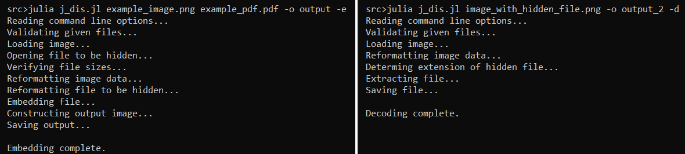
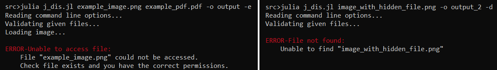

<h1 align="center">J-DIS</h1>

Julia Digital Image Steganography is a Julia application that uses Least Significant Bit Steganography to hide files in digital images.

The purpose of this project is to become more familiar with the Julia programming language in a fun and interesting way, as my final year project in university will be primarily written in Julia. Because this is just a fun project to further other goals long term support is unlikely, but hopefully others find it intersesting and useful too.
<ul>
<li><a href="#overview" title="Overview">Overview</a></li>
<li><a href="#julia-package-dependencies" title="Julia Package Dependencies">Dependencies</a></li>
<li><a href="#future-versions--current-issues" title="Future Versions / Current Issues">Future Versions</a></li>
<li><a href=(#how-to-use-j-dis"" title="How To Use J-DIS">Tutorial</a></li>
</ul>

 

## Overview

J-DIS is a steganography application capable of hiding .txt, .doc/.docx, .pdf and .zip files in .png and .jpg/.jpeg images. It does this by embedding the file data in the two least significant bits of a number of bytes in an image. The program can decode these files again, automatically determining the type of file that was originally hidden.

J-DIS consists of only one file, which is run from the command line. It is not a Julia module and does not export any functions or macros. A tutorial on how to use J-DIS is given below.

 

## Julia Package Dependencies
J-DIS uses the follwing packages:
- [Images](https://juliaimages.org/latest/ "JuliaImages")
- [FileIO](https://github.com/JuliaIO/FileIO.jl "JuliaIO/FileIO")
- [Printf](https://docs.julialang.org/en/v1/stdlib/Printf/ "Printf")
- [ArgMacros](https://github.com/zachmatson/ArgMacros.jl "ArgMacros")
- [Suppressor](https://github.com/JuliaIO/Suppressor.jl "JuliaIO/Suppressor")
  

## Future Versions / Current Issues

Currently J-DIS only works with two dimensional images. An image that is a single row or column of pixels will crash the program. This should hopefully be rectified in the near future.

J-DIS can only embed files in .png and .jpg/.jpeg files, and always produces a .png as output when embedding files. More image types may be supported as input/output files in the future.

  
 

## How To Use J-DIS

To use J-DIS you must have Julia installed and working. Make sure all the necessary packages(see the <a href="#julia-package-dependencies" title="Julia Package Dependencies">dependencies</a> section) have been installed. This can be done by opening the Julia REPL and using the <a href="https://docs.julialang.org/en/v1/stdlib/Pkg/" title="Pkg Documentation">Pkg</a> package manager. The following commands will add the necessary packages when entered in the REPL:

<pre><code>julia>using Pkg
julia>Pkg.add("Images")
julia>Pkg.add("FileIO")
julia>Pkg.add("Printf")
julia>Pkg.add("ArgMacros")
julia>Pkg.add("Suppressor")
</code></pre>
 

Your Julia environment should now be ready to run J-DIS. The following steps and images demonstrate how to run the program.

J-DIS can be run in two modes; encode mode and decode mode. These are indicated by the <i>-e</i> and <i>-d</i> flags respectively.  Open your command line terminal of choice. To run the program make sure you are in the same directory as the <b>j_dis.jl</b> source file, or are using the relevant path to the file. The first part of the command to be exectued is the word <i>julia</i>, followed by the name of the J-DIS script, <i>j_dis.jl</i>. The other command line arguments depend on which mode you wish to use. Arguments 1-4 are for encode mode, while 5-7 are for decode mode. All files must be in your current working directory, or the relevant file paths used.

<b>Encode Mode</b>
<ol>
<li>The name of the image you want to hide a file in. You do not have to overwrite this image with the output image. This will only happen if argument number three is the same filename as this argument.</li>
<li>The name of the file you wish to hide. The original file is preserved, and an exact copy embedded in the output image.</li>
<li>The <i>-o</i> flag. This the name of the output image. You do not need to specify the extension of this file, the program will append the extension for you if it is omitted or incorrect.</li>
<li>The <i>-e</i> flag. This indicates you wish to use the encode mode. This should not be used with the <i>-d</i> flag from point number 6.</li>
</ol>

<b>Decode Mode</b>
<ol start="5">
<li>The name of the image which contains the hidden file. You do not have to overwrite this image with the output image. This will only happen if argument number six is the same filename as this argument.</li>
<li>The <i>-o</i> flag. This the name of the output image. You do not need to specify the extension of this file, the program will append the extension for you if it is omitted or incorrect. This means that it is not necessary to know the type of file hidden before you extract it.</li>
<li>The <i>-d</i> flag. This indicates you wish to use the decode mode. This shoudl not be used with the <i>-e</i> flag from point number 4.</li>
</ol>

  

Due to how the <a href="https://github.com/zachmatson/ArgMacros.jl" title="ArgMacros">ArgMacros</a> package works, it is highly recommended you supply the command line arguments in the order specified above. This order will guarantee the correct execution of the program.

J-DIS will let provide you with progress messages as it executes. If something goes wrong it will provide an error message to inform you of the possible issues that may have occured. Examples of the progress and error messages are shown in the images below. The encode mode examples are on the left, and decode mode examples are on the right.

 

